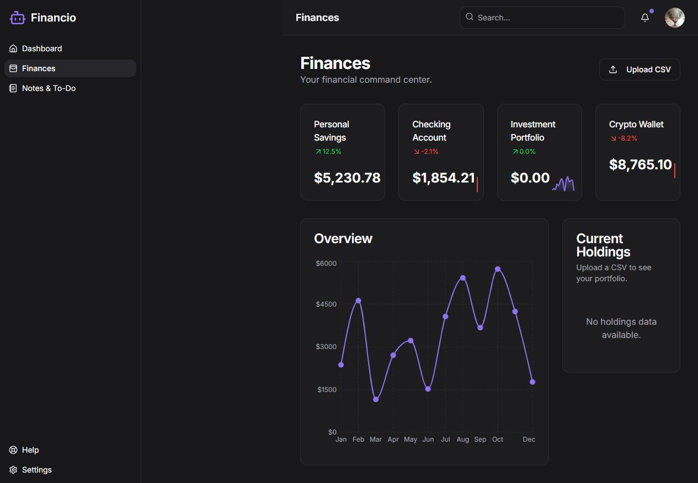

# Financio

Financio is a responsive financial workspace for reviewing holdings, organizing notes, and arranging a personalized dashboard. It combines a Next.js interface with deterministic CSV ingestion, live market-price lookups, and an optional direct Gemini summary adapter.



## Highlights

- Drag-and-drop dashboard widgets with saved browser preferences
- CSV upload workflow for portfolio holdings
- Offline-capable CSV parsing with Zod-validated input and output
- Small direct Gemini REST adapter for optional narrative summaries
- Financial Modeling Prep price lookups through server-side actions
- Editable holdings, account summaries, notes, and to-do lists
- Responsive navigation, theme controls, charts, and reusable UI components

## Architecture

| Area | Implementation |
| --- | --- |
| Web application | Next.js 16, React 19, TypeScript |
| Styling | Tailwind CSS, Radix UI, Recharts |
| Data extraction | Deterministic parser, Zod schemas, optional Gemini REST summary |
| Market data | Financial Modeling Prep API |
| Client state | React state and browser local storage |
| Deployment | Firebase App Hosting configuration |

The CSV workflow runs as a server action. Parsing and calculations are deterministic; missing live quotes fall back to imported prices. When configured, Gemini receives only normalized holdings and produces a one-sentence summary. Dashboard preferences and processed results remain in browser storage.

## Credential-free demo mode

The complete UI and CSV workflow run without API keys. Use any synthetic CSV with `Symbol`, `Quantity`, and optional `Last Price` / `Current Value` columns. In this mode imported prices and a deterministic summary make the walkthrough reproducible; no financial data leaves the machine.

## Run locally

Requirements:

- Node.js 20 or newer
- Gemini API key (optional summary enhancement)
- Financial Modeling Prep API key (optional live quotes)

```bash
npm ci
cp .env.example .env.local
npm run dev
```

Set optional values in `.env.local` for model summaries or live prices. The screenshot above was captured from the credential-free demo.

## Quality checks

```bash
npm run typecheck
npm test
npm run build
npm audit --omit=dev
```

The Genkit dependency chain was removed in favor of native `fetch`; the current production audit reports zero known vulnerabilities.

The account balances shown before an upload are demonstration data. Do not upload financial records you are not authorized to process.
